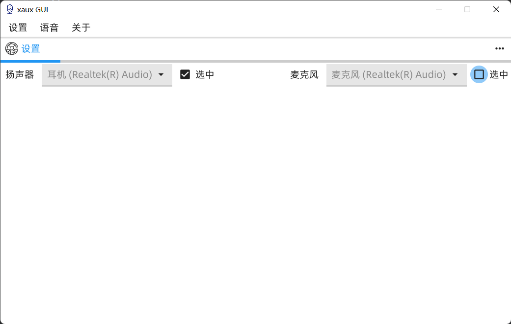
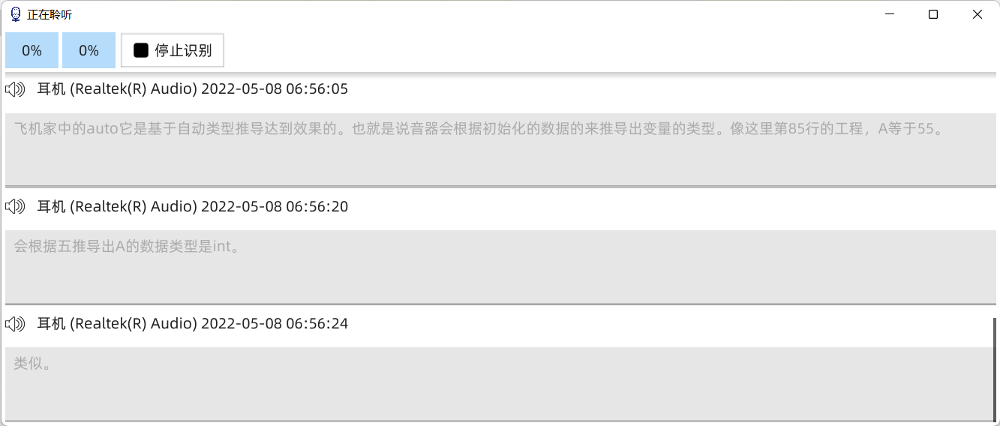

# xaux_gui

# 功能

- 支持阿里云语音实时流式识别，通过 [proxy](https://github.com/realzhangm/xaux/tree/main/cmd/proxy) 连接
- 实时转写将声音转写为文字

# 界面

主界面

实时转写界面

# TODO

- 会话保存
- 文字检索
- 音频保存/检索
- 实时翻译
- 离线转写
- 语义理解
- 辅助功能
- 支持其他公有云语音服务